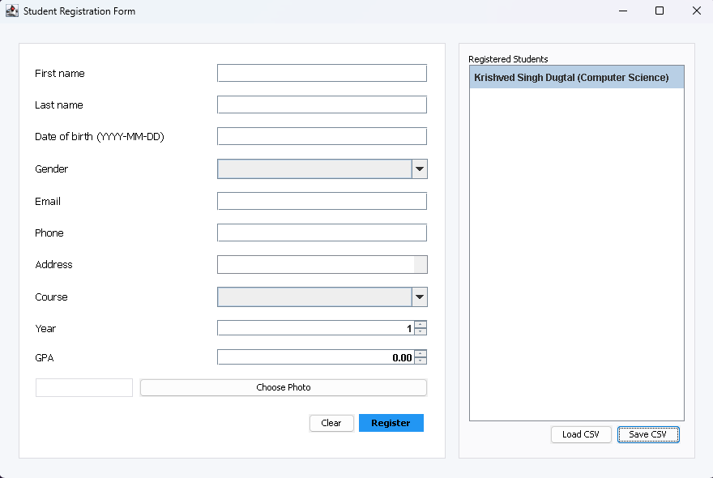
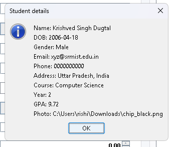

# Student Registration Form





A professional, pure-Java student registration desktop application implemented with Swing. It provides a responsive and polished UI for registering students, storing them in a lightweight in-memory store, and importing/exporting simple CSV files.

License
- This project is distributed under the terms in the [LICENSE](./LICENSE) file.

Key features
- Clean, modern Swing UI with responsive layout
- Photo chooser with preview
- Input validation (required fields, DOB format)
- GPA entry with two-decimal precision and safe commit behavior
- Export/Import students as CSV

Project structure

```
Student-Registration-Form/
├─ LICENSE
├─ README.md            # original (brief)
├─ README_FULL.md       # this professional README
├─ assets/
│  ├─ screenshot1.png    # ss1 (app main screen)
│  └─ screenshot2.png    # ss2 (alternate view)
└─ src/
   └─ com/example/registration/
      ├─ Student.java
      ├─ StudentDataStore.java
      └─ StudentRegistrationForm.java
```

How to build & run (Windows PowerShell)

1. Compile

```powershell
# Change directory to the repository root dynamically by walking up until a known marker (src/ or .git/) is found.
$p = Get-Location;
while ($p -ne $null -and -not (Test-Path (Join-Path $p.Path 'src') -PathType Container) -and -not (Test-Path (Join-Path $p.Path '.git') -PathType Container)) {
   $p = $p.ProviderPath -ne $null ? (Get-Item $p.Path).Parent : $null
}
if ($p -ne $null) { Set-Location $p.Path } else { Write-Error 'Repository root not found; change to repo manually.' }
if (-not (Test-Path out)) { New-Item -ItemType Directory -Path out | Out-Null }
$files = Get-ChildItem -Recurse -Filter '*.java' -File -Path src | ForEach-Object { $_.FullName }
javac -d out $files
```

2. Run

```powershell
java -cp out com.example.registration.StudentRegistrationForm
```

Notes & tips
- Requires JDK 11 or newer.
- The app stores students in memory; use "Save CSV" to persist data.
- If you want a packaged executable JAR or native installer, I can add a Gradle build and packaging steps.

Next steps (suggested)
- Improve CSV escaping with a proper CSV library (Apache Commons CSV)
- Add unit tests (JUnit) and a Gradle build so CI can run tests automatically
- Provide a JavaFX version for richer styling and theming

Contact / contributions
- Contributions are welcome. Open an issue or a pull request with suggested improvements or fixes.

